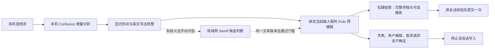

# Recordian 本地流式语音输入方案

日期：2026-09-24。此文件说明设计、依据和验收标准；任务状态以项目 beads 为准，实测结果单独记录。

## 目标与产品边界

说话时在当前输入框显示可修订的预编辑文本，松开录音键后将纠错结果通过输入法提交一次。用户确认优先场景为中文夹英文，以及浏览器、微信和编辑器；验收包含英文产品名、技术词、中文标点、长句和输入框切换。语音处理部署在用户本机或指定局域网服务器；云端 GPT 不参与识别、纠错或开发执行。GLM 5.3、Grok 4.7、Kimi K3 CLI 承担实现、测试和交叉审查，协调者负责设计、分工和最终结果审核。

“实时修改错字”发生在当前语音会话拥有的预编辑区。用户已经提交的正文、移动后的光标位置和另一个应用的输入框不属于可自动改写范围。部分工具包可能在失焦时自行提交客户端预编辑，必须通过真实应用测试说明限制。

## 当前不足

| 观察 | 对使用的影响 | 处理方式 |
| --- | --- | --- |
| Fcitx 插件只有 CommitText，并可能选择最近使用但未聚焦的输入上下文 | 不能安全更新预编辑，存在输入到错误窗口的风险 | 绑定聚焦上下文的会话接口，焦点变更使旧会话失效 |
| realtime accumulator 使用退格修订已经提交的文本 | 光标移动、用户键入、Unicode 组合字符会破坏假设 | 预编辑更新，最终一次提交；其他后端只预览和句末提交 |
| 本地 Qwen session 反复识别累计音频 | 看似流式，长句计算和延迟会持续增加 | 如实声明能力，优先真正的增量 provider |
| HTTP chunk 请求与音频读取串行 | 网络或模型响应慢时积压，取消容易留下迟到结果 | 明确收发与结束协议，超时、取消、失败不能假装成功 |
| 当前配置启用流式，但本机 8000 服务未监听，Fcitx Recordian 对象不存在 | 配置与运行状态不一致 | 提供依赖、服务、接口能力检查和明确诊断 |
| SemIf helper 无实际调用，概率校验允许缺失分布 | “有文件”不代表纠错有效，未知结果可能被采信 | 有界候选决策、严格校验、默认保留与实际链路测试 |
| 同音替换、自动学习和高频词缺少充分来源区分 | 容易将识别错误积累成长期热词 | 显式词表优先，歧义保留，模型输出不自动变成用户确认 |
| 项目已有大量未提交的用户修改 | 直接并行施工会混淆修改归属 | 源工作区保留，候选分支记录基线快照和分工 |

## 识别模型选择

| 路线 | 适用位置 | 依据与限制 |
| --- | --- | --- |
| Confucius4-R2T2 | 首先验证本机 NVIDIA GPU；远端通过 WebSocket 接入 | 官方提供增量输出与 80 ms–2 s 分块，平均延迟数据是上游评测，不是本机承诺。现有 CUDA 包不能直接证明 AMD 可运行 |
| Qwen3-ASR vLLM | 复用现有本机模型和环境的过渡方案 | 官方有流式推理，但假设可能修订，仍需预编辑区；当前累计音频重识别包装不能等同于增量解码 |
| FunASR 2pass / sherpa-onnx | CPU、较低算力设备或替代路线 | 借鉴在线识别、离线修正及解码时热词偏置；是否优于当前模型必须以相同音频测量 |

上游 Confucius 源码参考固定为 `c4611929bc3592b38dab34e96a8c9940d6da3755`。接入以源码和实际握手为准：JSON 头部、16 kHz 单声道 PCM16、增量 text、分段 reset、EOS 和连接结束必须逐项处理。不得把 `reset` 当成清空整个转写，也不能把异常断开当成功结束。热词上下文字段和认证方式按固定版本合同处理，认证值仅从运行环境或用户配置获得。

本机检查到 RTX 4070 Laptop 8GB；192.168.5.111 为 AMD 平台，并运行其他模型。ASR 首先验证本机；服务器已有 SemIf 可复用。没有经过内存预算、正确性和延迟验证，不替换服务器已有服务。

## 输入与纠错链路

音频采集 → 增量 ASR → 当前假设 → 确定性热词处理 → 有歧义时有限候选判断 → 输入法预编辑 → 最终纠错/可选精炼 → 输入法一次提交。

Fcitx 会话必须检查 token、聚焦上下文、敏感输入能力和生命周期。更新不能重新抢焦点，重复完成必须幂等，取消和超时必须使迟到结果失效。非预编辑后端保留实时浮窗，最终提交一次；不以退格模拟输入法修订。

热词从显式别名、音近候选和用户确认的词表中产生，设置数量与长度上限。SemIf 只在给定候选中选择，始终保留原文选项；请求失败、超时、结构错误、分数不足或候选之外的答案均保留原文。判定必须结合原句、候选词和必要上下文，不能凭“语义顺畅”删除刚识别的字。数字、URL、代码标识和否定表达需要独立反例。

SemIf 不应阻塞音频采集线程。单次合成例的约 85 ms 响应只证明连通性，不证明业务准确率或 p95。默认行为必须可预测，接口和预算集中配置，避免每增加一个 provider 就改动多个互相矛盾的默认值。

## 验收标准

| 层次 | 必须提供的证据 |
| --- | --- |
| 代码与配置 | provider 注册、CLI/持久化配置可达，依赖声明完整，无隐式云端 GPT 路由 |
| 回归 | 基线与修改后的相关测试原始输出，失败不能通过删除有效断言掩盖 |
| 流式协议 | 独立收发、部分结果、跨分段 reset、最终文本、超时、断连、取消、迟到结果的测试 |
| 输入法 | 实际插件构建；隔离 Fcitx/DBus 输入上下文中的预编辑更新与一次提交；焦点丢失和用户键入测试 |
| 语义质量 | 同音词、热词、非热词、数字、中英混输、否定、歧义、模型失败的正反例；修对率与误改率分别报告 |
| 模型实测 | 公开或用户授权音频，固定模型与配置；首字、末字、RTF、积压和资源占用的实际测量 |
| 使用体验 | GTK、Qt、Electron/浏览器等目标应用的实际观察；缺少的环境明确标记未验证 |

建议优化目标为持续识别实时率小于 1，首个可见结果 p95 不高于 800 ms，句末确认 p95 不高于 500 ms。目标应随测试音频和设备一起报告；单样本和模拟服务不能证明这些分位数。

## 资料来源

- Confucius4-R2T2 官方仓库：<https://github.com/netease-youdao/Confucius4-R2T2>
- Confucius 固定源码：<https://github.com/netease-youdao/Confucius4-R2T2/tree/c4611929bc3592b38dab34e96a8c9940d6da3755>
- Qwen3-ASR 官方流式说明：<https://github.com/QwenLM/Qwen3-ASR>
- Fcitx 预编辑与焦点说明：<https://fcitx-im.org/wiki/Develop_an_simple_input_method>
- FunASR 服务与两遍识别：<https://github.com/modelscope/FunASR/blob/main/runtime/quick_start.md>
- sherpa-onnx 热词偏置：<https://k2-fsa.github.io/sherpa/onnx/hotwords/index.html>

Confucius 代码与模型权重使用不同许可证。个人验证和软件分发的材料应分别标明对应条款，不能将代码的 Apache-2.0 自动套用到权重。
